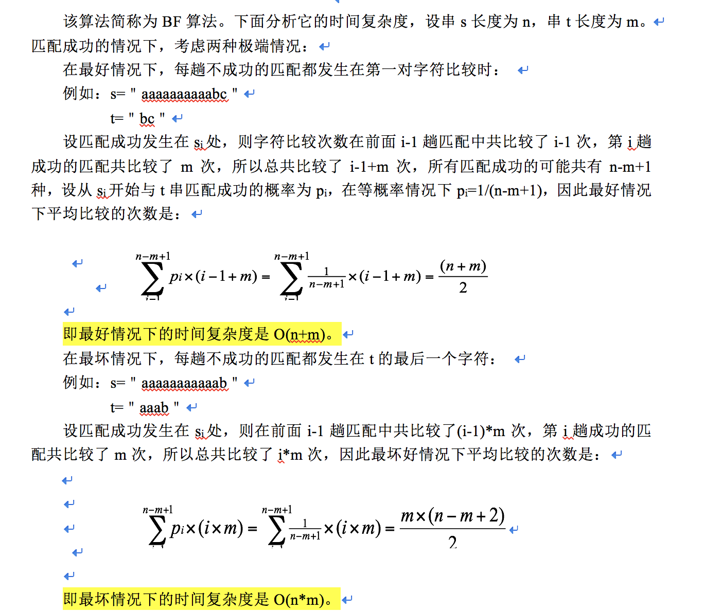
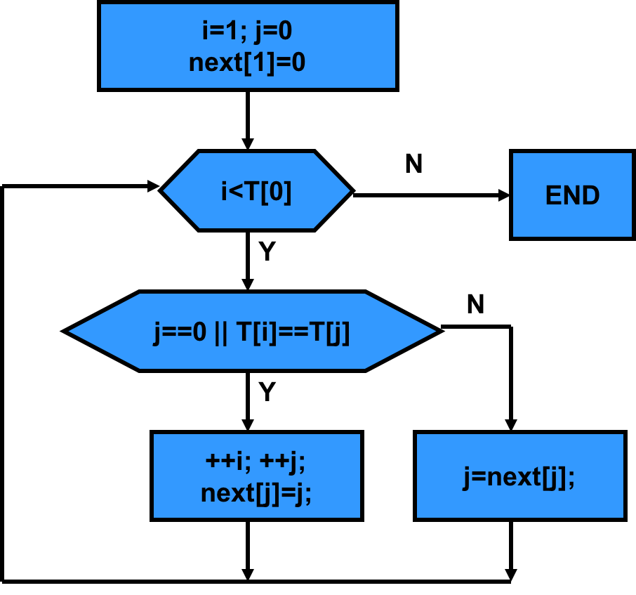

# 字符串模式匹配与正则表达式

## 字符串基本概念与运算

### 定义
> 串（即字符串）是一种特殊的线性表
> 串是由零个或多个任意字符组成的字符序列。一般记作：s=＂s1 s2 … sn＂  
> s是串名；  
> 用双引号作为串的定界符，引号引起来的字符序列为串值，引号本身不属于串的内容；  
> ai(1<=i<=n)是一个任意字符，它称为串的元素，是构成串的基本单位，i是它在整个串中的序号;    
> n为串的长度，表示串中所包含的字符个数，当n=0时，称为空串  

### 几个概念
> 子串与主串：串中任意连续的字符组成的子序列称为该串的子串。包含子串的串相应地称为主串。  
> 子串的位置：子串的第一个字符在主串中的序号称为子串的位置。  
> 串相等：称两个串是相等的，是指两个串的长度相等且对应字符都相等  

### 基本运算
1. 求串长StrLength(s)
   ```js
   let a = s.length;
   ```
2. 串赋值StrAssign(s1,s2)
   ```js
   let s = 'abc'
   ```
3. 连接操作 ：StrConcat (s1,s2,s) 或StrConcat (s1,s2)
   ```js
   let s = 's1' + 's2'
   ```
4. 求子串SubStr (s,i,len)
   ```js
   let sub_s = s.substr(0, 3)
   ``` 
5. 串比较 StrCmp(s1,s2)
   ```js
   let equal = s1 === s2
   ```
6. 子串定位 StrIndex(s,t)：找子串t在主串s中首次出现的位置
   ```js
   let idx = s.indexOf('s1')
   ```
7. 串插入 StrInsert(s,i,t)
8. 串删除 StrDelete(s,i,len)
9. 串替换　StrRep(s,t,r)
    ```js
    s.replace(s1, s2)
    ```

### 模式匹配

#### 定义
> 设s和t是给定的两个串，在主串s中找到等于子串t的过程称为模式匹配，如果在s中找到等于t的子串，则称匹配成功，函数返回t在s中的首次出现的存储位置(或序号)，否则匹配失败，返回-1

#### BF算法

> 算法思想如下：  
> 首先将s1与t1进行比较，若不同，就将s2与t1进行比较，...，直到s的某一个字符si和t1相同，再将它们之后的字符进行比较，若也相同，则如此继续往下比较，当s的某一个字符si与t的字符tj不同时，则s返回到本趟开始字符的下一个字符，即si-j+2，t返回到t1，继续开始下一趟的比较，重复上述过程。若t中的字符全部比完，则说明本趟匹配成功，本趟的起始位置是i-j+1或i-t[0]，否则，匹配失败


```js
function BF(s, t){
    let s_len = s.length;
    let t_len = t.length;
    let i = j = 0;
    while(i < s_len && j < t_len){  
        console.log(i, j,s[i], t[j], s[i] === t[j] )
        if(s[i] === t[j]){      // 判断相等
            ++i; ++j;           // 相等则都向后移动
        } else {            
            i = i - j + 1       // 不相等时，t回到原点，从头开始，i从上次开始的位置向后移动一位，继续比较
            j = 0;
        }
    }
    console.log(i, j)
    if(j >= t_len){
        return i - j      // 找到i上次开始的位置
    } else {
        return -1
    }
}

let s = 'ababcabcacbab'
let t = 'abcac'
BF(s, t)
```

> 复杂度分析  
> 最坏情况为每次比较到 t 的最后一位时不匹配，这时 t 回到原点，s后移一位继续匹配；  
> 总的比较次数为 (s_len - t_len + 1) * t_len; O(n * m)  
> 但一般情况BF的时间复杂度为O(n + m)  



#### KMP算法
是由克努特(Knuth)，莫里斯(Morris)和普拉特(Pratt)同时设计的，简称KMP算法  
 
> 算法思想：    
> BF算法慢的主要原因是在回溯，每趟不匹配的时候，模式串 t 都要回溯到原点，s也要回溯到上次开始的下一位，重新进行匹配，其实回溯不是必要的     
> 假设匹配过程中， 在 si 位置和 tj 位置发生了不匹配    
> 此时假设，下一次应该用 si 和 tk 进行比较，即 s 不回溯，t回溯到k位置，那么应该有以下结论    
> 因为 s[i-1-j] 到 s[i-1] 和 t[0]到t[j-1]是匹配的，所以如果下一次从 t[k] 开始比较的话    
> 1. s[i-1-k] 到 s[i-1] 应该和 t[0]到t[k-1]匹配    
> 2. s[i-1-k]到s[i-1] 和 t[j-1-k] 到 t[j-1]本就是匹配的   
> 所以，我们需要找到一个k，使得 t[0]到t[k-1] 和 t[j-1-k]到t[j-1]是匹配的    
> 从上面可以看出，只需要在模式串 t 上找到一个 k，满足条件即可，与s串并无关系，且s串无需回溯  
> 根据模式串T的规律："T1…Tk-1"="Tj-(k-1) …Tj-1"，和已知的当前失配位置j，可以计算新起点k的表达式, 令k=next[j]  
> 其实，next数组考虑的就是除当前字符外的最长相同**前缀** **后缀**  
> next数据的生成也是一个匹配的过程，不过是模式串t自身的匹配
> 



```js
let gene_next = (t) => {
    let next = []
    next[0] = -1
    let i = 0;
    let k = -1;
    let t_len = t.length
    while (i < t_len) {
        if (k == -1 || t[i] == t[k]) {
            k++;
            i++
            next[i] = k;
        } else {
            k = next[k];
        }
    }
    return next
}

function KMP(s, t){
    let next = gene_next(t)
    console.log(next)
    let s_len = s.length;
    let t_len = t.length;
    let i = j = 0;
    while(i < s_len && j < t_len){  
        console.log(i, j,s[i], t[j], s[i] === t[j] )
        if(s[i] === t[j]){      // 判断相等
            ++i; ++j;           // 相等则都向后移动
        } else {            
            j = next[j];
        }
    }
    console.log(i, j)
    if(j >= t_len){
        return i - j      // 找到i上次开始的位置
    } else {
        return -1
    }
}
KMP(s,t)
```

参考：
https://www.jianshu.com/p/d4cf13b32111
https://www.cnblogs.com/zhangtianq/p/5839909.html


## 正则表达式基本使用

正则表达式(regular expression)描述了一种字符串匹配的模式（pattern），可以用来检查一个串是否含有某种子串、将匹配的子串替换或者从某个串中取出符合某个条件的子串等。

字符 | 描述
---- | ----
`\`	| 转义符
`^` | 匹配输入字符串的开始位置,如果设置了 RegExp 对象的 Multiline 属性，^ 也匹配 '\n' 或 '\r' 之后的位置。 
`$`	| 匹配输入字符串的结束位置,如果设置了RegExp 对象的 Multiline 属性，$ 也匹配 '\n' 或 '\r' 之前的位置。
`*` | 匹配前面的子表达式零次或多次, 等价于{0,}。
`+` | 匹配前面的子表达式一次或多次, 等价于 {1,}。例如，'zo+' 能匹配 "zo" 以及 "zoo"，但不能匹配 "z"
`?`	| 匹配前面的子表达式零次或一次, 等价于 {0,1}。例如，"do(es)?" 可以匹配 "do" 或 "does" 
`{n}` | n 是一个非负整数。匹配确定的n 次
`{n,}` | n 是一个非负整数。至少匹配n 次。
`{n,m}` | m 和 n 均为非负整数，其中n <= m。请注意在逗号和两个数之间不能有空格。
`?` | 当该字符紧跟在任何一个其他限制符 (*, +, ?, {n}, {n,}, {n,m}) 后面时，匹配模式是非贪婪的。非贪婪模式尽可能少的匹配所搜索的字符串，而默认的贪婪模式则尽可能多的匹配所搜索的字符串。例如，对于字符串 "oooo"，'o+?' 将匹配单个 "o"，而 'o+' 将匹配所有 'o'。
`.` | 匹配除换行符（\n、\r）之外的任何单个字符。要匹配包括 '\n' 在内的任何字符，请使用像"(.|\n)"的模式。
`x|y` | 匹配 x 或 y
`[xyz]` | 字符集合, 匹配所包含的任意一个字符。
`[^xyz]` | 负值字符集合。匹配未包含的任意字符。例如， '[^abc]' 可以匹配 "plain" 中的'p'、'l'、'i'、'n'。
`[a-z]` | 字符范围。匹配指定范围内的任意字符。例如，'[a-z]' 可以匹配 'a' 到 'z' 范围内的任意小写字母字符。
`[^a-z]` | 负值字符范围。匹配任何不在指定范围内的任意字符
`\b` |  匹配一个单词边界，也就是指单词和空格间的位置。例如 'er\b' 可以匹配"never" 中的 'er'，但不能匹配 "verb" 中的 'er'。
`\B` | 匹配非单词边界。'er\B' 能匹配 "verb" 中的 'er'，但不能匹配 "never" 中的 'er'。
`\d` | 匹配一个数字字符。等价于 [0-9]。
`\D` | 匹配一个非数字字符。等价于 [^0-9]。
`\n` | 匹配一个换行符
`\r` | 匹配一个回车符
`\s` | 匹配任何空白字符，包括空格、制表符、换页符等等。等价于 [ \f\n\r\t\v]。
`\S` | 匹配任何非空白字符。等价于 [^ \f\n\r\t\v]。
`\t` | 匹配一个制表符。等价于 \x09 和 \cI。
`\v` | 匹配一个垂直制表符。等价于 \x0b 和 \cK。
`\w` | 匹配字母、数字、下划线。等价于'[A-Za-z0-9_]'。
`\W` | 匹配非字母、数字、下划线。等价于 '[^A-Za-z0-9_]'。
`\num` | 匹配 num，其中 num 是一个正整数。对所获取的匹配的引用。例如，'(.)\1' 匹配两个连续的相同字符。
`(pattern)` | 匹配 pattern 并获取这一匹配
`(?:pattern)`  | 匹配 pattern 但不获取匹配结果，也就是说这是一个非获取匹配，不进行存储供以后使用。这在使用 "或" 字符 (|) 来组合一个模式的各个部分是很有用。例如， 'industr(?:y|ies) 就是一个比 'industry|industries' 更简略的表达式。
`(?=pattern)` | 正向肯定预查（look ahead positive assert），在任何匹配pattern的字符串开始处匹配查找字符串。这是一个非获取匹配，也就是说，该匹配不需要获取供以后使用。例如，"Windows(?=95|98|NT|2000)"能匹配"Windows2000"中的"Windows"，但不能匹配"Windows3.1"中的"Windows"。预查不消耗字符，也就是说，在一个匹配发生后，在最后一次匹配之后立即开始下一次匹配的搜索，而不是从包含预查的字符之后开始。
`(?!pattern)` | 正向否定预查(negative assert)，在任何不匹配pattern的字符串开始处匹配查找字符串。这是一个非获取匹配，也就是说，该匹配不需要获取供以后使用。例如"Windows(?!95|98|NT|2000)"能匹配"Windows3.1"中的"Windows"，但不能匹配"Windows2000"中的"Windows"。预查不消耗字符，也就是说，在一个匹配发生后，在最后一次匹配之后立即开始下一次匹配的搜索，而不是从包含预查的字符之后开始。
`(?<=pattern)` | 反向(look behind)肯定预查，与正向肯定预查类似，只是方向相反。例如，"(?<=95|98|NT|2000)Windows"能匹配"2000Windows"中的"Windows"，但不能匹配"3.1Windows"中的"Windows"。
`(?<!pattern)` | 反向否定预查，与正向否定预查类似，只是方向相反。例如"(?<!95|98|NT|2000)Windows"能匹配"3.1Windows"中的"Windows"，但不能匹配"2000Windows"中的"Windows"。

### 基本语法

#### 1. 简单元字符
元字符是在正则中有特定意义的标识， `\d`、`\w`这样的叫元字符，而`{n,m}`、`(?!exp)`这样的也叫元字符

- `.` 匹配除了换行符以外的任意字符
- `\w` 匹配任意字母、数字或者下划线，等价于 `[0-9a-zA-Z_]`。 js中不能匹配汉字
- `\s` 匹配任意空白字符，包含换页符`\f`、换行符`\n`、回车符`\r`、水平制表符`\t`、垂直制表符`\v`
- `\d` 匹配数字，等价于 `[0-9]`
- `\uxxx` 匹配 unicode 字符，超出`\ufff`的使用es6 的 `u` 修饰符

#### 2. 限定符 - 标示出现（重复）次数

- a*表示字符a连续出现次数 >= 0 次
- a+表示字符a连续出现次数 >= 1 次
- a?表示字符a出现次数 0 或 1 次
- a{5}表示字符a连续出现次数 5 次
- a{5,}表示字符a连续出现次数 >= 5次
- a{5,10}表示字符a连续出现次数为 5到10次 ，包括5和10

#### 3. 定位符和零宽断言 - 匹配位置

【百科】用于查找在某些内容(但并不包括这些内容)之前或之后的东西，也就是说它们像\b,^,$那样用于指定一个位置，这个位置应该满足一定的条件(即断言)，因此它们也被称为零宽断言

匹配某个位置的表达式都是零宽的，这是主要包含两部分，一是定位符，匹配一个特定位置，二是零宽断言，匹配一个要满足某要求的位置。

定位符有以下几个常用的：  
- `\b` 匹配单词边界位置，准确的描述是它匹配一个位置，这个位置前后不全是\w能描述的字符，所以像\u597d\babc是可以匹配“好abc”的。
- `^` 匹配字符串开始位置，也就是位置0，如果设置了 RegExp 对象的 Multiline 属性，^ 也匹配 '\n' 或 '\r' 之后的位置
- `$` 匹配字符串结束位置，如果设置了RegExp 对象的 Multiline 属性，$ 也匹配 '\n' 或 '\r' 之前的位置

零宽断言（JS支持的）有以下两个：

- `(?=exp)` 匹配一个位置，这个位置的右边能匹配表达式exp，注意这个表达式仅仅匹配一个位置，只是它对于这个位置的右边有要求，而右边的东西是不会被放进结果的，比如用read(?=ing)去匹配“reading”，结果是“read”，而“ing”是不会放进结果的
- `(?!exp)` 匹配一个位置，这个位置的右边不能匹配表达式exp

#### 4. 字符簇和分歧 - 表达【或】

字符簇可以表示字符级别的【或】含义
- `[abc]` 表示 a, b, c 这三个字符中的任意一个，如果字母或数字是连续的，可以使用 `-` 表示，`[b-f]` 表示b到f任意一个
- `[(ab)(cd)]` 匹配a、b、c、d、(、)这6个字符中的任一个，在方括号中，圆括号被当成普通字符看待，**但最好显式地转义**

分歧用来表示表达式级别的【或】含义，`|` 表示
-  `ab|cd` ab 或 cd
-  **短路匹配** 用(ab|abc)去匹配字符串“abc”，结果会是“ab”，因为竖线左边的已经满足了，就用左边的匹配结果代表整个正则的结果

#### 5. 表示【非】的含义
- `\W` 除了字母、数字、下划线外的字符
- `\D` 非数字字符
- `\S` 非空白符
- `\B` 非单词边界位置
- `[^aeiou]` 表示除了a、e、i、o、u外的任一字符，在方括号中且出现在开头位置的^表示排除，如果^在方括号中不出现在开头位置，那么它仅仅代表^字符本身

#### 6. 分组和后向引用 

圆括号的使用

- 将括起来的部分当作整体，后面可以添加限定符，如`(abc){5}`
- 分组匹配到的内容也就是这个分组捕获到的内容，从左往右，以左括号为标志，每个分组会自动拥有一个从1开始的编号，编号0的分组对应整个正则表达式，JS不支持捕获组显示命名
- 分组捕获到的内容，可以在之后通过\分组编号的形式进行**后向引用**。比如`(ab|cd)123\1`可以匹配“ab123ab”或者“cd123cd”，但是不能匹配“ab123cd”或“cd123a
- 圆括号可以改变优先级，比如 `abc|de和(abc|d)e` 表达的是完全不同的意思


#### 7. 优先级
优先级从高到低是：  
- 转义 `\`
- 括号（圆括号和方括号）`()`, `(?:)`, `(?=)`, `[]`
- 字符和位置
- 竖线 `|`

#### 8. 贪婪与非贪婪
默认是贪婪模式，尽可能多的匹配

在默认的模式（贪婪）下，会尽可能多的匹配内容。比如用ab*去匹配字符串“abbb”，结果是“abbb”。

而通过在限定符后面加问号?可以进行非贪婪匹配，会尽可能少地匹配。用ab*?去匹配“abbb”，结果会是“a”。

不带问号的限定符也称**匹配优先量词**，带问号的限定符也称**忽略匹配优先量词**

#### 9. 修饰符（匹配选项）
其实正则的匹配选项有很多可选，不同的宿主语言环境下可能各有不同，

JS的修饰符说明：

- `g` 表示全局匹配，模式将被应用到所有字符串，而不是在发现第一个匹配项时停止
- `i` 表示不区分大小写
- `m` 表示多行模式，会改变^和$的行为


### 正则引擎

正则的引擎基本分为两类：DFA 和 NFA  
1. DFA (Deterministic finite automaton) 确定型有穷自动机
2. NFA (Non-deterministic finite automaton) 非确定型有穷自动机  

“确定型”指，对于某个确定字符的输入，这台机器的状态会确定地从a跳到b。   
“非确定型”指，对于某个确定字符的输入，这台机器可能有好几种状态的跳法；   
“有穷”指，状态是有限的，可以在有限的步数内确定某个字符串是否被接受   

DFA引擎不需要进行回溯，所以匹配效率一般情况下要高，但是它并不支持捕获组，于是也就不支持反向引用和$这种形式的引用，也不支持环视(Lookaround)、非贪婪模式等一些NFA引擎特有的特性  

扩展学习：   
[什么是NFA(不确定的有穷自动机)和DFA(确定的有穷自动机)](https://www.cnblogs.com/AndyEvans/p/10240790.html)

参考：  
菜鸟教程：https://www.runoob.com/regexp/regexp-metachar.html  
js正则讲解：https://www.jianshu.com/p/681d3e07fb0f  
正则匹配过程：https://www.cnblogs.com/study-everyday/p/7426862.html  


## leetcode
1. [easy] - https://leetcode.com/problems/implement-strstr/
2. [easy] - https://leetcode.com/problems/repeated-substring-pattern/
3. [hard] - https://leetcode.com/problems/shortest-palindrome/ 最短回文串
4. [hard] - https://leetcode.com/problems/regular-expression-matching/ 正则实现