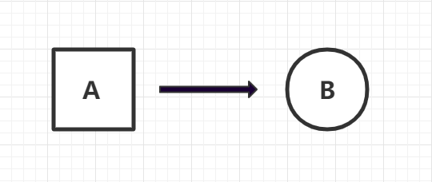
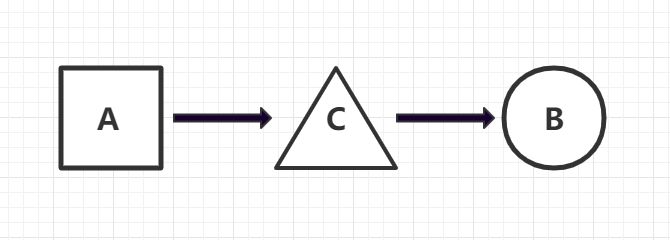

# CSS Animation

## 一、为什么需要动画

人们对会动的东西更加关注，所以在网站的设计和开发中，如果能适当地添加一些动画，不仅可以丰富网站的视觉和交互体验，还能更有效地抓住用户的眼球，吸引他们的注意力，从而更加关注和沉浸在我们的网站里，这可比只用简单的文字好多了。而且现代浏览器的性能越来越高，对动画地支持也越来越好，更有利于我们使用动画了。【Tips：也不能滥用动画。如果滥用反而会造成注意力的分散。】

## 二、CSS 中的动画

使用 `flash`、`canvas`、`javascript` 都可以在浏览器中制作动画，今天我们主要讲 `CSS` 中的动画

CSS 中的动画主要由以下2个属性决定的

- **Transition Property**
- **Animation Property** & **keyframes**

### 1. **Transition Property**

啥是 `transition` ? `transition` 指从一个“状态”到另一个“状态”的动画模拟, 直译过来就是 “过渡”



#### 1.1、 语法

`transition` 的语法如下

```css
.element {
    transition: [property] [duration] [timing-function] [delay]
}
```
上面的写法是缩写形式，就像 `padding`,  `margin`一样，可以将缩写进行展开

```css
.element {
    transition-property: [property];
    transition-duration: [duration];
    transition-timing-function: [property];
    transition-delay: [delay];
}
```

实际代码写法如下

```css
.element {
    transition: opacity 3s ease-in-out 0s;
}
```

#### 1.2、 Transition properties

- `transition-property`:  过渡的CSS 属性名称

    如果要修改 background,  这里就可以写上 background, 如何有多个属性的修改， 这里可以写 all 

- `transition-duration`:  过渡的持续时间，单位可以是 s 或者 ms

- `transition-timing-function`:  时间函数, 和`animation`中相同，后续展开介绍

- `transition-delay`:  过渡效果的延迟时间 (效果开始前的等待时间)， 单位可以设置成 s 或者 ms

#### 1.3、 Transition property 

当然，不是所有的属性都可以设置不是所有的属性变化都可以设置 过渡效果，常见的，我们可以设置 `color`, `background`, `opacity`, `font-size` 等属性

还有一些我们常用的属性，不能够设置 过渡效果， 像 `position` (fix => absolute) , `display` (inline => block),  `background-image` (渐变色背景) ， `font-family` 等

[Animatable CSS properties](https://developer.mozilla.org/en-US/docs/Web/CSS/CSS_animated_properties)

#### 1.4、 Triggering

`transition`  通常是由某种“动作”触发，比如鼠标 Hover 悬停，或者用 JavaScript 添加或删除样式类

- Hover
- Class Change

#### 1.5 Demo

[Transition Demo](https://codepen.io/Yangjia/pen/zYYexNp)

### 2. **Animation Property** & **keyframes**

animation 属性可以将编写的 keyframes 应用到元素上

#### 2.1、 keyframes

> `@keyframes` 规则通过在动画序列中定义关键帧（或waypoints）的样式来控制CSS动画序列中的中间步骤

- 语法
```css
@keyframes [name] {
  from {
    [styles]
  }
  to {
    [styles]
  }
}
```
- code

```css
@keyframes myframes {
  from {
    height: 200px;
    background: pink;
  }

  to {
    height: 400px;
    background: yellow;
  }
}
```
`@keyframes` 规则级中的 `from`, `to` 还可以用 0% , 100% 来代替，如果需要定义更多的帧, 还可以加入像 20%， 50% 等等

#### 2.2、 Animation

`Animation` 可以是多个“状态”间的变化



- 语法
```css
.element{
  animation: [name] [duration] [timing-function] [delay] 
    [iteration-count] [direction] [fill-model] [play-state]
}
```

非缩写

```css
.element{
  animation-name: [name];
  animation-duration: [duration];
  animation-timing-function: [timing-function];
  animation-delay: [delay];
  animation-iteration-count: [iteration-count];
  animation-direction: [direction];
  animation-fill-model: [fill-model];
  animation-play-state: [play-state];
}
```

#### 2.3、 Animation properties

- **`animation-name`**

    指定应用的一系列动画，每个名称代表一个由   `@keyframes` 定义的动画序列，可以同时设置多个动画序列，中间用逗号分隔 

- **`animation-duration`**
    
    动画完成一个周期所需要的时间, 和 `transition-duration` 类似，单位是 s 或者 ms

- **`animation-timing-function`**

    时间函数
- **`animation-delay`**
    
    和 `transition-delay` 类似, 动画开始前的等待时间，单位是 s 或者 ms，当存在多个动画时很管用

    注意：如果定义的动画是循环的，`delay` 属性并不是在每个周期内都生效 (ps: 只有第一个循环存在等待时间，后面就没有)

    属性值还可以是负数，例如 -2 s, 动画会直接从第 2s 开始执行

- **`animation-iteration-count`**

    定义动画结束前运行的次数， 默认值为 1, 可以设置成 `infinite`, 无限循环动画，也可以设置成小数 0.5， 播放动画的一半，但不可以设置成负数

- **`animation-direction`**
    
    动画默认从 0% 开始， 100% 结束, 该属性值可以是: `normal`, `reverse`, `alternate`, `alternate-reverse`

    - `normal`: 默认值
    - `reverse`: 从 100% 到 0%
    - `alternate`: 动画轮流反复播放，即从 0% 播放到 100% 然后再播放到 0%
    - `alternate-reverse`: 动画轮流反复播放，即从 100% 播放到 0% 然后再播放到 100%

- **`animation-fill-model`**
    
   设置CSS动画在执行之前和之后如何将样式应用于其目标。属性值: `normal`, `forwards`, `backwards`, `both`

    - `normal`: 默认值, 通过已有的CSS规则来显示目标元素
    - `forwards`: 动画结束之后，保留由执行期间遇到的最后一个关键帧计算值，最后一帧取决与 `animation-direction` 和 `animation-iteration-count`, 具体参考 [MDN](https://developer.mozilla.org/zh-CN/docs/Web/CSS/animation-fill-mode)
    - `backwards`: 动画开始之前，立即应用第一个关键帧中定义的值，第一个关键帧取决于`animation-direction`的值
    - `both`: 同时遵循`forwards` 和 `backwards` 规则
    
- **`animation-play-state`**

    动画是否暂停或运行， 属性值 `running`(默认值), `paused`

#### 2.4、 Demo

[Animation Demo](https://codepen.io/Yangjia/pen/zYYexNp)

## 三、总结

#### 3.1、 何时使用动画？

动画可以吸引用户，但不可滥用动画，导致用户抓不住重点

#### 3.2、 Animation 、Transition 区别

- `Transition` (过渡)： 从状态A 过渡到 状态 B, 通过 Hover, Class Change 等方式才能触发
- `Animation` (动画)： 从状态A 过渡到状态 C, 再到 状态 B, 可以自动开始、循环、暂停等

## 四、小技巧和习题

#### 4.1 小技巧
- [MDN](https://developer.mozilla.org/zh-CN/)
- [动画库](https://animista.net/)
- 搜索技巧 `css xxx generator`

#### 4.2 习题

一组同心圆逐渐变大（tip: wukong 数据大屏效果）


