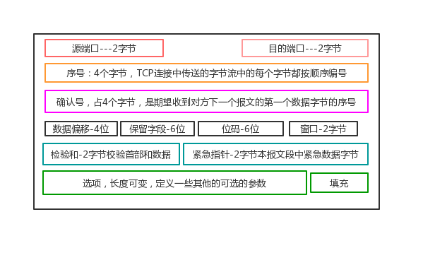
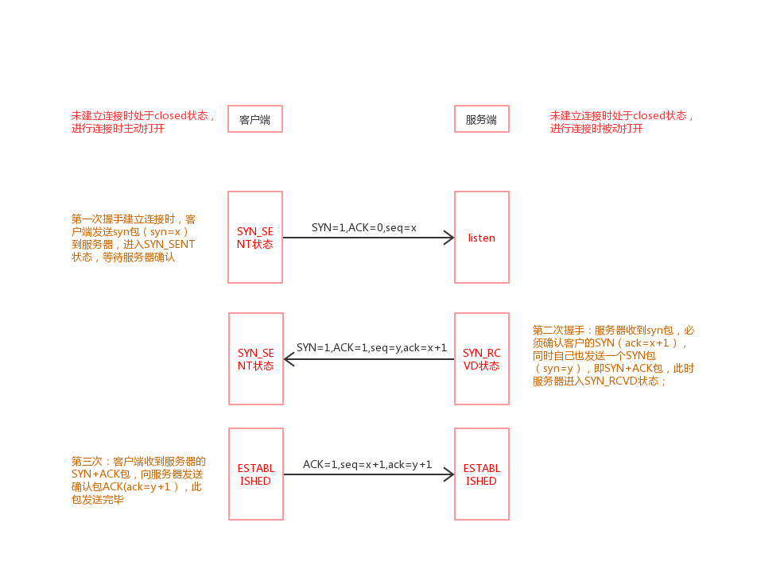

### tcp三次握手协议

#### 一、tcp首部

源端口和目的端口，各占2个字节，分别写入源端口和目的端口

序号，占4个字节，TCP连接中传送的字节流中的每个字节都按顺序编号。例如，一段报文的序号字段值是 301 ，而携带的数据共有100字段，显然下一个报文段（如果还有的话）的数据序号应该从401开始

确认号，占4个字节，是期望收到对方下一个报文的第一个数据字节的序号。例如，B收到了A发送过来的报文，其序列号字段是501，而数据长度是200字节，这表明B正确的收到了A发送的到序号700为止的数据。因此，B期望收到A的下一个数据序号是701，于是B在发送给A的确认报文段中把确认号置为701

数据偏移，占4位，它指出TCP报文的数据距离TCP报文段的起始处有多远

保留，占6位，保留今后使用，但目前应都位0

紧急URG，当URG=1，表明紧急指针字段有效。告诉系统此报文段中有紧急数据

确认ACK，仅当ACK=1时，确认号字段才有效。TCP规定，在连接建立后所有报文的传输都必须把ACK置1

推送PSH，当两个应用进程进行交互式通信时，有时在一端的应用进程希望在键入一个命令后立即就能收到对方的响应，这时候就将PSH=1

复位RST，当RST=1，表明TCP连接中出现严重差错，必须释放连接，然后再重新建立连接

同步SYN，在连接建立时用来同步序号。当SYN=1，ACK=0，表明是连接请求报文，若同意连接，则响应报文中应该使SYN=1，ACK=1

终止FIN，用来释放连接。当FIN=1，表明此报文的发送方的数据已经发送完毕，并且要求释放

窗口，占2字节，指的是通知接收方，发送本报文你需要有多大的空间来接受

检验和，占2字节，校验首部和数据这两部分

紧急指针，占2字节，指出本报文段中的紧急数据的字节数

选项，长度可变，定义一些其他的可选的参数

#### 二、状态码简介

`LISTEN` - 侦听来自远方TCP端口的连接请求；

`SYN-SENT` -在发送连接请求后等待匹配的连接请求；

`SYN-RECEIVED` - 在收到和发送一个连接请求后等待对连接请求的确认；

`ESTABLISHED` - 代表一个打开的连接，数据可以传送给用户；

`FIN-WAIT-1` - 等待远程TCP的连接中断请求，或先前的连接中断请求的确认；

`FIN-WAIT-2` - 从远程TCP等待连接中断请求；

`CLOSE-WAIT` - 等待从本地用户发来的连接中断请求；

`CLOSING` - 等待远程TCP对连接中断的确认；

`LAST-ACK` - 等待原来发向远程TCP的连接中断请求的确认；

`TIME-WAIT` -等待足够的时间以确保远程TCP接收到连接中断请求的确认；

`CLOSED` - 没有任何连接状态；

#### 三、tcp标志位 --- 位码

1. `SYN`(synchronous)：建立联机
2. `ACK`(acknowledgement)：确认 
3. `PSH`：DATA数据传输
4. `FIN`(finish)：结束
5. `RST`(reset)：重置
6. `URG`(urgent)：紧急
7. `Sequence number`：顺序号码
8. `Acknowledge number`：确认号码

`位码出现的情况概述`

1. ACK是可能与SYN，FIN等同时使用的，比如SYN和ACK可能同时为1，它表示的就是建立连接之后的响应，

2. SYN与FIN是不会同时为1的，因为前者表示的是建立连接，而后者表示的是断开连接。

3. RST(重置)一般是在FIN(结束连接)之后才会出现为1的情况，表示的是连接重置。

4. 出现FIN包或RST包时，客户端与服务器端断开了连接

5. PSH(DATA数据传输) = 1的情况，一般只出现在DATA内容 != 0的包中，也就是说PSH = 1表示的是有真正的TCP数据包内容被传递。

#### 四、握手过程

>最开始的时候客户端和服务器都是处于CLOSED状态。主动打开连接的为客户端，被动打开连接的是服务器。

1. TCP服务器进程先创建传输控制块TCB，时刻准备接受客户进程的连接请求，此时服务器就进入了LISTEN（监听）状态

2. TCP客户进程也是先创建传输控制块TCB，向服务器发出连接请求报文，这时报文首部中的同部位SYN=1，同时选择一个初始序列号 seq=x ，此时，TCP客户端进程进入了 SYN-SENT（同步已发送状态）状态。TCP规定，SYN报文段（SYN=1的报文段）不能携带数据，但需要消耗掉一个序号。

3. TCP服务器收到请求报文后，如果同意连接，则发出确认报文。确认报文中应该 ACK=1，SYN=1，确认号是ack=x+1，同时也要为自己初始化一个序列号 seq=y，此时，TCP服务器进程进入了SYN-RCVD（同步收到）状态。这个报文也不能携带数据，但是同样要消耗一个序号。

4. TCP客户进程收到确认后，还要向服务器给出确认。确认报文的ACK=1，ack=y+1，自己的序列号seq=x+1，此时，TCP连接建立，客户端进入ESTABLISHED（已建立连接）状态。TCP规定，ACK报文段可以携带数据，但是如果不携带数据则不消耗序号。
当服务器收到客户端的确认后也进入ESTABLISHED状态，此后双方就可以开始通信了

`问题1：为什么ack = y + 1`

> 服务器对客户端的数据进行确认，因为已经收到序列号为y的数据包，准备接受序列号为y+1的数据包，所以确认号ack=y+1。

`问题2：为什么seq = x + 1`
> ACK报文段可以携带数据，因此如果不携带数据，不消耗序列号，则下一个报文的序列号仍然是seq=x+1；如果携带数据，则序列号为在x+1的基础上增加携带数据的大小。此处默认第三次握手客户端不发送携带数据的报文段

`问题3： 如果已经建立了连接，但是客户端突然出现故障了怎么办`
>TCP还设有一个保活计时器，显然，客户端如果出现故障，服务器不能一直等下去，白白浪费资源。服务器每收到一次客户端的请求后都会重新复位这个计时器，时间通常是设置为2小时，若两小时还没有收到客户端的任何数据，服务器就会发送一个探测报文段，以后每隔75秒钟发送一次。若一连发送10个探测报文仍然没反应，服务器就认为客户端出了故障，接着就关闭连接。

`问题4： 为啥只有三次握手才能确认双方的接受与发送能力是否正常，而两次却不可以？`
>第一次握手：客户端发送网络包，服务端收到了。这样服务端就能得出结论：客户端的发送能力、服务端的接收能力是正常的
>第二次握手：服务端发包，客户端收到了。这样客户端就能得出结论：服务端的接收、发送能力，客户端的接收、发送能力是正常的。不过此时服务器并不能确认客户端的接收能力是否正常
>第三次握手是为了防止：如果客户端迟迟没有收到服务器返回确认报文，这时会放弃连接，重新启动一条连接请求，但问题是：服务器不知道客户端没有收到，所以他会收到两个连接，浪费连接开销。如果每次都是这样，就会浪费多个连接开销。

`问题4衍生问题：为什么TCP客户端最后还要发送一次确认呢`
>一句话，主要防止已经失效的连接请求报文突然又传送到了服务器，从而产生错误。
>如果使用的是两次握手建立连接，假设有这样一种场景，客户端发送了第一个请求连接并且没有丢失，只是因为在网络结点中滞留的时间太长了，由于TCP的客户端迟迟没有收到确认报文，以为服务器没有收到，此时重新向服务器发送这条报文，此后客户端和服务器经过两次握手完成连接，传输数据，然后关闭连接。此时此前滞留的那一次请求连接，网络通畅了到达了服务器，这个报文本该是失效的，但是，两次握手的机制将会让客户端和服务器再次建立连接，这将导致不必要的错误和资源的浪费。

`问题5：（ISN）是固定的吗`

>三次握手的一个重要功能是客户端和服务端交换ISN(Initial Sequence Number), 以便让对方知道接下来接收数据的时候如何按序列号组装数据。如果ISN是固定的，攻击者很容易猜出后续的确认号，因此 ISN 是动态生成的。

`问题6：什么是半连接队列`

>服务器第一次收到客户端的 SYN 之后，就会处于 SYN_RCVD 状态，此时双方还没有完全建立其连接，服务器会把此种状态下请求连接放在一个队列里，我们把这种队列称之为半连接队列。当然还有一个全连接队列，就是已经完成三次握手，建立起连接的就会放在全连接队列中。

`问题7：SYN-ACK 重传次数的问题`

>服务器发送完SYN－ACK包，如果未收到客户确认包，服务器进行首次重传，等待一段时间仍未收到客户确认包，进行第二次重传，如果重传次数超 过系统规定的最大重传次数，系统将该连接信息从半连接队列中删除。注意，每次重传等待的时间不一定相同，一般会是指数增长，例如间隔时间为 1s, 2s, 4s, 8s, ....

`问题8：三次握手过程中可以携带数据吗`

>很多人可能会认为三次握手都不能携带数据，其实第三次握手的时候，是可以携带数据的。也就是说，第一次、第二次握手不可以携带数据，而第三次握手是可以携带数据的,此时客户端已经处于 established 状态，也就是说，对于客户端来说，他已经建立起连接了，并且也已经知道服务器的接收、发送能力是正常的了，所以能携带数据页没啥毛病

`问题9：三次握手的作用`
>确认双方的接受能力、发送能力是否正常;
>指定自己的初始化序列号，为后面的可靠传送做准备。
>如果是 https 协议的话，三次握手这个过程，还会进行数字证书的验证以及加密密钥的生成到。为了防止已失效的连接请求报文段突然又传送到了服务端，因而产生错误
 
`问题10：握手失败`

>第一次握手A发送SYN传输失败，A,B都不会申请资源，连接失败。如果一段时间内发出多个SYN连接请求，那么A只会接受它最后发送的那个SYN的SYN+ACK回应，忽略其他回应全部回应，B中多申请的资源也会释放

>第二次握手B发送SYN+ACK传输失败，A不会申请资源，B申请了资源，但收不到A的ACK，过一段时间释放资源。周期性重传，如果是收到了多个A的SYN请求，B都会回复SYN+ACK，但A只会承认其中它最早发送的那个SYN的回应，并回复最后一次握手的ACK

>第三次握手ACK传输失败，B没有收到ACK，释放资源，对于后序的A的传输数据返回RST。实际上B会因为没有收到A的ACK会多次发送SYN+ACK，次数是可以设置的，如果最后还是没有收到A的ACK，则释放资源，对A的数据传输返回RST

#### 五、攻击过程

`syn溢出攻击`

>如果客户端伪造出大量第一次的sys同步报文，服务端就会依次消耗掉很多资源来保存客户端的信息，并进行确认，实际上确认是会失败的，但失败需要一定的时间，因为服务端会连续多次进行第二次握手确认后才认定失败。那么短时间有大量的sys同步报文涌向服务端，服务端资源可能被耗尽，就可能导致正常的客户端得不到响应而失败。

`防御措施：`

>缩短SYNTimeout时间,限制同时打开的SYN半连接数目
>SYN Flood攻击效果取决于服务器上保持的SYN半连接数，这个值=SYN攻击的频度 x SYN Timeout，设置20秒以下可以成倍的降低服务器的负荷。

>设置SYN Cookie
在TCP服务器接收到TCP SYN包并返回TCP SYN + ACK包时，不分配一个专门的数据区，而是根据这个SYN包计算出一个cookie值。这个cookie作为将要返回的SYN ACK包的初始序列号。当客户端返回一个ACK包时，根据包头信息计算cookie，与返回的确认序列号(初始序列号 + 1)进行对比，如果相同，则是一个正常连接，然后，分配资源，建立连接，如果短时间内连续受到某个IP的重复SYN报文，就认定是受到了攻击，以后从这个IP地址来的包会被丢弃。

>为防止TCP会话劫持，加密传输

推荐看看

- [TCP的推送比特PSH(Push)](https://blog.csdn.net/ce123_zhouwei/article/details/9038365)

参考链接 🔗
- [tcp 三次握手，四次挥手几常见面试题](https://www.cnblogs.com/kingle-study/p/9480689.html)
- [TCP的三次握手与四次挥手理解及面试题](https://blog.csdn.net/qq_38950316/article/details/81087809)
- [TCP协议的学习（三）TCP协议三次握手及攻击](https://blog.csdn.net/qq_34501940/article/details/51113965)
