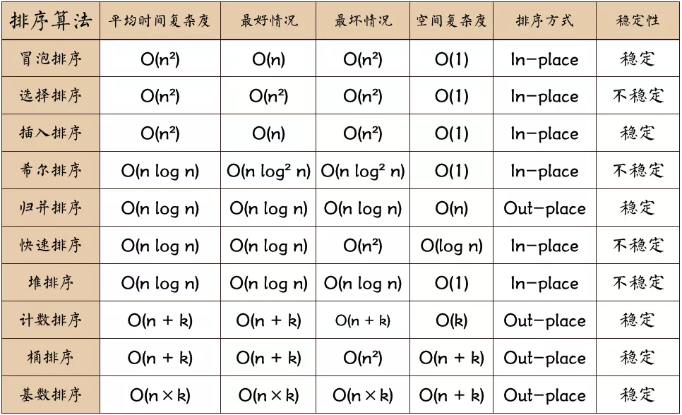
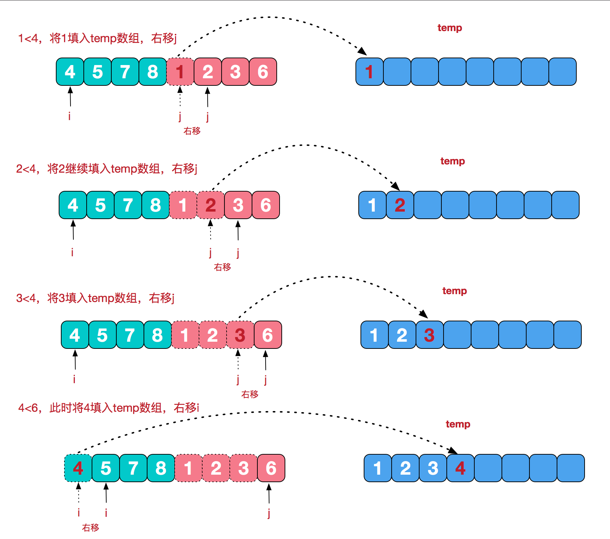

## 一、算法概述
- 分类

    > **非线性时间比较类排序**：通过比较来决定元素间的相对次序，由于其时间复杂度不能突破 `O(nlogn)`,  因此称为 非线性时间比较类排序
    >
    > **线性时间非比较类排序**：不通过比较来决定元素间的相对次序，同时时间复杂度突破比较类排序下限，以线性时间运行，故称为 线性时间非比较类排序

- 相关概念

    > **稳定性**：a,b 相等，排序前，a 在 b 前，排序后，a 仍在 b 前
    > 
    > **不稳定性**：a,b 相等，排序前，a 在 b 前，排序后，a 可能 b 后面
    > 

- 基于比较的排序算法
  - 冒泡
  - 选择
  - 插入
  - 归并 (基于递归)
  - 快速 (基于递归)
  - 堆排序
- 不基于比较的排序算法
  - 计数
  - 基数
  - 桶

- 对比

  

---
## 二、算法分析  

### 1. 冒泡排序(Bulle Sort)

- **概述**

  给定一个 N 个元素的数组，冒泡排序将：

  1.  比较一对相邻元素 a 和 b
  2.  如果元素大小关系不正确，交换这俩个元素
  3.  重复步骤 1 和 2，直到到达数组尾部
  4.  一轮比较结束，最大的元素将在最后位置，然后我们将 N 减少 1，开始下一轮比较，直到 N = 1。

- **JS 代码实现**

  ```js
  function bubbleSort(arr) {
    const len = arr.length;
    for (let i = 0; i < len; i++) {
      for (let j = 0; j < len - 1 - i; j++) {
        if (arr[j] > arr[j + 1]) {
          let temp = arr[j + 1];
          arr[j + 1] = arr[j];
          arr[j] = temp;
        }
      }
    }
    return arr;
  }

  const a = [3,34,48,20,15,36,12,6]
  bubbleSort(a) // [3,6,12,15,20,34,36,48]
  ```

- **动图显示**

  

-  **分析**
   
   冒泡排序中有俩个嵌套循环，外层循环运行 N 次循环， 里层进行比较， 时间复杂度为 `O(n^2)`

   > **缺点**: 效率低，无论是否数组有序或无序，都会进行循环
     
   例如: `arr` 为 [3,6,12,15,20,34,36,48], 已经排序好了, 改进之处就是，如果内部循环未发生一次交换，则说明已经是排序好的，可跳出循环

    ```js
    function bubbleSort(arr) {
      const len = arr.length;
      for (let i = 0; i < len; i++) {
        let flag = false
        for (let j = 0; j < len - 1 - i; j++) {
          if (arr[j] > arr[j + 1]) {
            let temp = arr[j + 1];
            arr[j + 1] = arr[j];
            arr[j] = temp;
            flag = true
          }
        }
        if (!flag) break;
      }
      return arr;
    }
    ```

### 2. 选择排序(Selection Sort)

 - **概述**

    给定一个 N 个元素的数组和 L = 0，选择排序将：
    
    1. 从 `[L, N-1]` 的范围中找出最小项目`X`的位置 
    2. 用 `L` 项替换 `X` 项
    3. 将范围下限`L`加 1 并重复步骤 1，知道 `L=N-2`

 - **JS 代码实现**
    ```js
    function selectionSort(arr) {
      const len = arr.length;
      let minIndex;
      let temp;
      for (let i = 0; i< len - 1; ++i) {
        minIndex = i
        for (let j = i+1; j < len; j ++) {
          if (arr[j] < arr[minIndex]) {
            minIndex = j
          }
        }
        temp = arr[i]
        arr[i] = arr[minIndex]
        arr[minIndex] = temp
      }
      return arr
    }
    const a = [3,34,48,20,15,36,12,6]
    selectionSort(a) // [3,6,12,15,20,34,36,48]
    ```
 - **动图演示**

    

 - **分析**

    时间复杂度 ：`T(n) = O(n2)`

### 3. 插入排序(Insertion Sort)

 - **概述**
    
    插入排序和打扑克牌时从右到左整理牌一样，

    

    原理是通过构建有序队列和无序队列, 对于无序队列中的数据，在有序队列中从后向前扫描，找到对应的位置插入

 - **JS 代码实现**
    ```js
    function insertionSort(arr){
      const len = arr.length
      for (let i = 1; i < len; i++) {
        let temp = arr[i];
        let j
        for (j = i - 1; j >=0; j--) {
          if (arr[j] > temp) {
            arr[j + 1] = arr[j]
          } else break;
        }
        arr[j + 1] = temp
      }
      return arr
    }
    const a = [3,34,48,20,15,36,12,6]
    insertionSort(a) // [3,6,12,15,20,34,36,48]
    ```
 - **动图演示**

   

 - **分析**

   时间复杂度 ：`T(n) = O(n2)`

### 4. 希尔排序(Shell Sort)
  - **概述**
  
  希尔排序也叫**缩小增量排序**, 插入排序的增强版。通过间接序列的设定，将数组进行分组，对每组的元素进行插入排序
 
  指定一个增量 `gap`，对数组分组，使得每相距 `gap-1` 的元素为一组，共分成 `gap` 组，对每组执行插入排序。逐步缩小 `gap` 的大小并继续执行插入排序，直到为1，也就是整个数组作为一组，对整个数组执行插入排序

  - **JS 代码实现**
    ```js
    function shellSort(arr) {
        const len = arr.length
        let temp
        let gap = 1
        while (gap < len /5) {
            gap = gap * 5 + 1
        }
        for (gap; gap > 0; gap = Math.floor(gap /5)) {
            for (let i = gap; i < len; i++) {
                temp = arr[i]
                let j
                for (j = i - gap; j >= 0 && arr[j] > temp; j -=gap) {
                    arr[j + gap] = arr[j]
                }
                arr[j + gap] = temp
            }
        }
        return arr
    }
    const a = [8,9,1,7,2,3,5,4,6,0,6]
    shellSort(a)
    ```
  - **动图演示**

    
  - **分析**

### 5. 归并排序(Merge Sort)
  - **概述**

    归并算法采用经典的分治策略

    > **分**: 将一个大问题拆分成很多小问题递归求解
    >
    > **治**: 将分阶段的结果 "拼接" 在一起

  - **图片演示**

    - 分而治之

        
    
    - 合并相邻的有序子序列

        在 `治` 阶段，如何将相邻的已经排序好的子序列合并成一个，以最后一个为例，显示如何将 `[4,5,7,8]` 与 `[1,2,3,6]` 合并成 `[1,2,3,4,5,6,7,8]`

        
        

  - **JS 代码实现**
    
    ```js
    function mergeSort(arr) {
      const len = arr.length;
      if (len < 2) return arr;
      const middle = Math.floor(len / 2)
      const left = arr.slice(0, middle)
      const right = arr.slice(middle)
      return merge(mergeSort(left), mergeSort(right))
    }

    function merge(left, right) {
      let result = []
      while(left.length && right.length) {
        if (left[0] > right[0]) {
          result.push(right.shift())
        } else {
          result.push(left.shift())
        }
      }
      if (left.length) result.push(...left)
      if (right.length) result.push(...right)
      return result
    }
    ```

  - **分析**

### 6. 快速排序(Quick Sort)
  - **概述**
  
    给定一个 N 个元素的数组，快速排序将：

    1. 选择一个基准元素 `pivot`, 可以是数组中任意一个元素，通常选取第一个
    2. 遍历数组，小于 `pivot` 的元素放到数组 `left`, 等于 `pivot` 的元素放到数组 `middle`, 大于 `pivot` 的元素放到数组 `right`
    3. 递归`left`, `right`数组，继续执行步骤1，直到数组仅剩一个元素
    4. 递归的同时将三个数组进行组合

  - **JS 代码实现**
    ```js
    function quickSort (arr) {
        const len = arr
        let pivot = arr[0]
        let left = [], middle = [pivot], right = []
        for (let i = 1; i < len; ++i) {
          if (arr[i] < pivot) {
            left.push(arr[i])
          } else if (arr[i] > pivot) {
            right.push(arr[i])
          } else middle.push(arr[i])
        }
        return quickSort(left).concat(middle, quickSort(right))
    }
    ```
  - **动图演示**

    

  - **分析**
   
    时间复杂度 `T(n) = O(nlogn)`


### 7. 桶排序(Bucket Sort)

 - **概述**

    生活中的例子，公司对所有员工按年龄排序，可以先按照年龄段分成以下几组:[20, 30), [30, 40), [40, 50), [50, ~], 组内再进行排序

    桶排序大致流程如下：
    1. 确定范围，也就是数组的最大、最小值
    2. 确定桶的数量 (通常作为参数传递进来， 不能大于数组的长度), 最大值减去最小值，除了桶的数量，就可以得到每个桶能存放的元素的 `range`
    3. 遍历数组中的所有元素，除以这个 `range`, 商的整数部分对于桶的索引，插入该桶
    4. 元素插入同时，不单单是简单的 `push`, 可使用 `插入排序` ,直接排序好
    5. 遍历结束，每个桶内都排好了序，而且桶也是默认排好序的，将桶中数据依次取出拼接在一起就OK了

 - **JS 代码实现**
   ```js
   function bucketSort (arr, num) {
       const len = arr.length
       const min = Math.min(...arr)
       const max = Math.max(...arr)
       let buckets = []
       // 初始化桶
       for(let i = 0; i < num; i++) buckets[i] = []
       // 范围
       const range = (max - min + 1) / num
       for(let j = 0; j < len; j ++) {
           const bucketIndex = Math.floor((arr[j] - min) / range)
           let bucket = buckets[bucketIndex]
           if (!bucket.length) {
              bucket.push(arr[j]) 
           } else {
               // 插入排序
               let i = bucket.length - 1
               while(i >=0 && bucket[i] > arr[j]) {
                 bucket[i + 1] = bucket[i] // 大的向后移一位  
                 i--;
               }
                bucket[i + 1 ] = arr[j]
           }
       }
       let result = []
       buckets.forEach(item => {
           result = result.concat(item)
       })
       return result
   }
   const aaa = [35,5,16,49,27,31,13]
   bucketSort(aaa, 4)
   ```
 - **动图演示**
 - **分析**

### 8. 计数排序(Counting Sort)

 - **概述**
 
    如果要排序的项目是小范围的整数，我们可以计算每个整数（在这个小范围内）的出现频率，然后通过循环该小范围来按排序顺序输出项目。

 - **JS 代码实现**
    ```js
    function countingSort(arr) {
      const len = arr.length
      let C = [], B = []
      let minVal = arr[0], maxVal = arr[0]
      for(let i = 0; i < len; i++) {
        minVal = arr[i] <= minVal ? arr[i] : minVal
        maxVal = arr[i] >= maxVal ? arr[i] : maxVal
        C[arr[i]] = C[arr[i]] ? C[arr[i]] + 1 : 1
      }

      // 计算排序后的元素下标
      for(let j = minVal; j < maxVal; ++j){
        C[j + 1] = (C[j + 1] || 0) + (C[j] || 0)
      }

      for (var k = len - 1; k >= 0; k--) {
        B[C[arr[k]] - 1] = arr[k];
        C[arr[k]]--;
      }
      return B;
    }
    ```
    例外一种写法
    ```js
    function countingSort(arr) {
      const len = arr.length
      let C = []; let B = [];
      let minVal = arr[0], maxVal = arr[0]
      for(let i = 0; i < len; i++) {
        C[arr[i]] = C[arr[i]] ? C[arr[i]] + 1 : 1
      }

      // 遍历统计数组
      for(let j = 0; j < C.length; ++j) {
        while(C[j] > 0) {
          B.push(j)
          C[j]--
        }
      }
      return B;
    }
    ```
 - **动图演示**

   

 - **分析**

    时间复杂度为O（N + k），其中 k 是输入的整数范围，如果 k 很小，那么它就是 `O（N）`。

### 9. 基数排序(Radix Sort)

 - **概述**

    `基数排序` 通过比较元素对应位置上的数字的大小来进行排序, 个位与个位，十位与十位比较...

    根据比较顺序不同，分成以下俩种

    - **LSD**: 从低位开始比较
    - **MSD**: 从高位开始比较

 - **LSD**
   
   - 大概流程

      1. 找到最大的一个元素，获取其长度 `max_len`
      2. 俩层循环， 外层循环 `max_len` 次，从个位开始，内层循环数组
      3. 每次外层循环开始前，初始化 `10` 个桶(ps: 每个位置上的数值都是 `0~9` 中一个)，比较每个元素在该位置上数值大小，放入到对于的桶中
      4. 每次外层循环结束，把`10`个桶依次取出，覆盖原数组, 重复以上步骤

   - **JS 代码实现**
     ```js
     function radixSortLSD (arr) {
       const max = Math.max(...arr)
       const max_len = (max + '').length

       for (let digit = 0; digit < max_len; ++digit) {
         // 0~9 10个桶  
         let buckets = []
         for (let i = 0; i < 10; i++) buckets[i] = []

         for (let j = 0; j < arr.length; j++) {
           // 当前元素
           const val = arr[j]
           // 当前元素在该位上的数值, 放入对于桶中
           const value_of_this_digit = getDigitValue(val, digit)
           buckets[value_of_this_digit].push(val)
         }

         // 内层循环结束，依次取出桶中的数, 组成新数组覆盖原数组
         let result = [].concat(...buckets)
         arr = result
       }
       return arr
     }

     function getDigitValue (num, pos) {
        return (num + '').split('').reverse()[pos] || 0 
     }

     const arr = [20,56,1096,2334,456,27,2343,50,193]
     radixSortLSD(arr)  // [20, 27, 50, 56, 193, 456, 1096, 2334, 2343]
     ```
   
    
   - **动图演示**

      

    - **分析**

    复杂度为 `O(k * n)`, n为数组长度，k为数组中的数的最大的位数；

 
 - **MSD** 

   - 大概流程
    
        1. 找到最大的一个元素，获取其长度 `max_len`
        2. 从最高位开始，找到每个元素在该位置上对于的数值，放入到对于桶中
        3. 当未循环到最后一个位置 `个位`， 若桶中的元素数量不为空，递归每个桶，比较下一位 
        4. 对于，没有重复元素而已，最后每个桶中就只有一个元素
        5. 若存在重复元素，肯定会放到同一个桶中，只需要判断是否已经比较到 `个位` 了

   - **JS 代码实现** 

        ```js
        function radixSortMSD (arr) {
        const max = Math.max(...arr)
        const max_len = (max + '').length

        const digit = max_len - 1
        return MSD(arr, digit)

        }

        function MSD (arr, digit) {
        // 0~9 10个桶  
        let buckets = []
        for (let i = 0; i < 10; i++) buckets[i] = []

        for (let i = 0; i < arr.length; i++) {
            let val = arr[i]
            const value_of_this_digit = getDigitValue(val, digit)
            buckets[value_of_this_digit].push(val)
        }

        let result = []
        for (let i =0; i < buckets.length; ++i) {
            // 
            if (buckets[i].length === 1) result = result.concat(buckets[i])
            // 存在相同元素且已经比较到 个位 了
            else if (buckets[i].length && digit === 0) result = result.concat(buckets[i])
            // 存在多个元素但当前比较位置还不是 个位
            else if (buckets[i].length && digit !== 0) result = result.concat(MSD(buckets[i], digit - 1))
        }
        return result
        }

        function getDigitValue (num, pos) {
        return (num + '').split('').reverse()[pos] || 0 
        }

        const arr = [20,56,1096,2334,456,27,2343,50,193]
        radixSortMSD(arr)
        ```

   - **图片演示**

        ```js
        // arr [11,56, 456,1893, 2]
        最大值：max 1893, max_len = 4
        // arr 相当于
        [0011, 0056, 0456, 1893, 0002]
        // digit = 3
        [[0011, 0056, 0456, 0002], [1893]]
        // 对数组中第一个数组进行迭代， 比较下一位
        [[[0011, 0056, 0002], [0456]], [1893]]
        // 继续迭代
        [[[[0002],[0011],...[0056]], [0456]], [1893]]
        // 当每个数组的元素个数为 1， 也就排好序了  
        [2,11,56,456,1893]  
        ``` 

 - **分析**
  
    时间复杂度：`T(n) = O(n * k)`, k 为最大元素的长度 