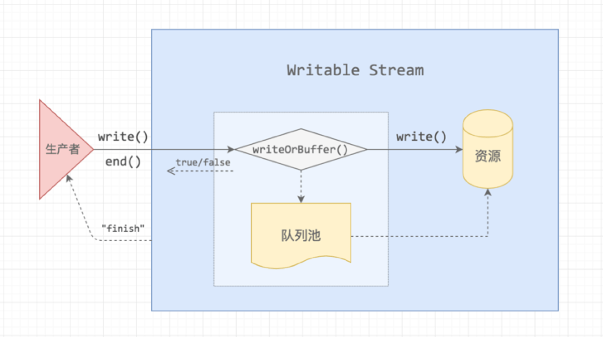

# nodejs - stream 理解     
     
stream 是nodejs中处理流式数据的抽象接口， `stream`模块提供流实现对应接口api。     
     
## 流的四种类型     
- `Writeable`：可写流     
- `Readable`：可读流     
- `Duplex`：可读可写流（双工）     
- `Transform`： 操作被写入数据，然后读出结果。     
     
     
## 对象模式(object mode)     
     
nodejs创建的流一般仅仅是操作 `string` 或 `buffer` (或者 `Uint8Array`)对象，同样的，对于js中的其他对象(`null` 对象除外，`null`在流中有特殊作用)也是可以用流来操作的，这种方式称为 `object mode` 。     
     
可以在创建流的时候通过 `obejctMode` 选项指定创建，将已有的流转换为 `objectMode`是不安全的     
     
     
## 缓冲     
     
可读流和可写流都使用一个内部缓冲队列来存储数据，可以分别用`writable.writableBuffer` 或 `readable.readableBuffer`来读取数据     
     
内部缓冲队列的大小由参数 `highWaterMark`决定，一般的stream对象中表示总的字节数，在`object mode`中表示对象的数量     
     
- 可读流的缓冲     
  在可读流中，通过`stream.push(chunk)` 写入内部缓冲队列，如果没有从缓冲队列消费的话，数据将持续的往缓冲队列中存储，直到达到`highWaterMark`阀值，达到最大值后，将暂停从数据源的读入，直到缓冲队列中的数据有消费后然后继续读取     
- 可写流的缓冲     
  在可写流中，通过`writable.write(chunk)` 写入内部缓冲队列，如果没有达到`highWaterMark`，`writable.write()`返回true，一旦达到将返回false     
     
stream API的一个重要目标就是将数据缓冲限制在一个可接受的水平，使不同速度的读出源和写入目标不会超过可用内存     
     
     
## 可读流 - Readable     
```js     
const stream = require('stream')     
let streamIns = new stream.Readable()   // 创建可读流对象     
streamIns._read = (chunk) => {return chunk.toString()} // 要实现 _read 方法，用来在触发data事件时读取数据     
streamIns.on("data", (data) => console.log(data.toString()))     
streamIns.push("hello world")   // 可读流中添加数据     
streamIns.push(null) // 结束可读流     
```     
     
- 通过 `new stream.Readable()` 构造函数创建可读流，使用`push()`函数往可读流中添加数据       
- `_read`方法是从底层系统读取具体数据的逻辑，即生产数据的逻辑, 可读流中需要实现该方法，用来数据读取       
- 监听`data`事件的方式来消耗可读流，监听事件后，可读流会不停的调用 _read(), 将数据通过触发data事件的形式输出       
- 当全部数据都生产出来后，必须调用`push(null)`来结束可读流, 流一旦结束，便不能再调用push(data)添加数据。       
     
### 可读流有三种状态：     
- `readable.readableFlowing === null`     
- `readable.readableFlowing === false`     
- `readable.readableFlowing === true`     
     
`readable.readableFlowing === null` 的时候，没有提供消耗流数据的方法，可读流不会生产数据。当添加了 `data`事件或调用`readable.pipe()`/`readable.resume()`, 则状态会转换 `true` ,可读流开始触发事件生产数据     
     
调用 `readable.pause()`, `readable.unpipe()` 或者达到 `背压(backpressure)` 时，状态会转换为`false`,此时会暂时停止数据的读入(`_read()`), 但是会继续生产数据      
     
### 可读流有两种模式：       
1. 流动模式 - flowing mode     
2. 暂停模式 - paused mode     
     
#### 流动模式     
     
流动模式下，数据会源源不断地生产出来，形成“流动”现象。 监听流的`data`事件便可进入该模式。     
     
流动模式的流程图如下:     
     
     
资源的数据流并不是直接流向消费者，而是先 push 到缓存池，缓存池有一个水位标记 highWatermark，超过这个标记阈值，push 的时候会返回 false;      
创建流后，监听data事件，或者通过pipe方法将数据导向另一个可写流，即可进入流动模式开始消耗数据;       
     
push 的时候会返回 false 的情况：     
- 消费者主动执行了 .pause()     
- 消费速度比数据 push 到缓存池的生产速度慢     
     
第二种情况称为【背压】     
     
##### 执行过程     
Stream继承自EventEmitter，且是Readable的父类。 在将fn加入事件队列后，如果发现处于非暂停模式，则会调用`this.resume()`，开始流动模式。     
     
`resume()`方法先将`state.flowing`设为`true`， 然后会在下一个tick中执行flow，试图将缓存读空：     
```js     
if (state.flowing) do {     
  var chunk = stream.read()     
} while (null !== chunk && state.flowing)     
```     
flow中每次read()都可能触发push()的调用， 而push()中又可能触发flow()或read()的调用， 这样就形成了数据生生不息的流动     
     
push()的一个分支逻辑     
```js     
if (state.flowing && state.length === 0 && !state.sync) {     
  stream.emit('data', chunk)     
  stream.read(0)     
} else {     
  state.length += state.objectMode ? 1 : chunk.length     
  state.buffer.push(chunk)     
     
  if (state.needReadable)     
    emitReadable(stream)     
}     
```     
第一个分支为立即输出。     
     
在立即输出的情况下，输出数据后，执行`read(0)`，进一步引起`_read()`和`push()`的调用，从而使数据源源不断地输出。     
     
在非立即输出的情况下，数据先被添加到缓存中。 此时有两种情况：      
  - `state.length`为0       
    这时，在调用`_read()`前，`state.needReadable`就会被设为true。 因此，一定会调用`emitReadable()`。 这个方法会在下一个tick中触发`readable`事件，同时再调用`flow()`，从而形成流动。      
  -  state.length不为0。      
    由于流动模式下，每次都是从缓存中取第一个元素，所以这时`read()`返回值一定不为null。 故`flow()`中的循环还在继续。     
     
此外，从`push()`的两个分支可以看出来，如果`state.flowing`设为false，第一个分支便不会再进去，也就不会再调用`read(0)`。 同时第二个分支中引发flow的调用后，也不会再调用`read()`，这就完全暂停了底层数据的读取。     
     
事实上，pause方法就是这样使流从流动模式转换到暂停模式的     
     
     
#### pipe     
     
考虑下面的例子：     
```js     
const fs = require('fs')     
fs.createReadStream(file).on('data', doSomething)     
```     
监听data事件后文件中的内容便立即开始不断地传给`doSomething()`。 如果`doSomething`处理数据较慢，就需要缓存来不及处理的数据data，占用大量内存。     
     
理想的情况是下游消耗一个数据，上游才生产一个新数据，这样整体的内存使用就能保持在一个水平。 Readable提供pipe方法，用来实现这个功能     
     
用pipe方法连接上下游     
```js     
const fs = require('fs')     
fs.createReadStream(file).pipe(writable)     
```     
writable是一个可写流Writable对象，上游调用其write方法将数据写入其中。 writable内部维护了一个写队列，当这个队列长度达到某个阈值（`state.highWaterMark`）时， 执行`write()`时返回false，否则返回true。     
     
当`write()`返回false时，调用`readable.pause()`使上游进入暂停模式，不再触发`data`事件。 但是当`writable`将缓存清空时，会触发一个`drain`事件，再调用`readable.resume()`使上游进入流动模式，继续触发`data`事件。     
     
使用`pipe()`时，数据的生产和消耗形成了一个闭环。 通过负反馈调节上游的数据生产节奏，事实上形成了一种所谓的拉式流（pull stream）。     
     
用喝饮料来说明拉式流和普通流的区别的话，普通流就像是将杯子里的饮料往嘴里倾倒，动力来源于上游，数据是被推往下游的；拉式流则是用吸管去喝饮料，动力实际来源于下游，数据是被拉去下游的。     
     
所以，使用拉式流时，是“按需生产”。 如果下游停止消耗，上游便会停止生产。 所有缓存的数据量便是两者的阈值和。     
     
当使用Transform作为下游时，尤其需要注意消耗     
     
     
#### 暂停模式     
     
暂停模式的流程图如下：     
     
     
暂停模式下，需要显示地调用`read()`，触发`data`事件     
     
资源池会不断地往缓存池输送数据，直到 highWaterMark 阈值       
消费者监听了 readable 事件并不会消费数据，需要主动调用 .read([size]) 函数才会从缓存池取出，并且可以带上 size 参数，用多少就取多少     
     
```js     
const myReadable = new MyReadable(dataSource);     
myReadable.setEncoding('utf8');     
myReadable.on('readable', () => {     
  let chunk;     
  while (null !== (chunk = myReadable.read())) {     
    console.log(`Received ${chunk.length} bytes of data.`);     
  }     
});     
```     
     
##### 消费过程     
```js     
const Readable = require('stream').Readable     
// 底层数据     
const dataSource = ['a', 'b', 'c']     
     
const readable = Readable()     
readable._read = function () {     
  if (dataSource.length) {     
    this.push(dataSource.shift())     
  } else {     
    this.push(null)     
  }     
     
//   // 异步     
//   process.nextTick(() => {     
//     if (dataSource.length) {     
//       this.push(dataSource.shift())     
//     } else {     
//       this.push(null)     
//     }     
//   })     
}     
     
// 进入暂停模式     
readable.pause()     
readable.on('data', data => process.stdout.write('\ndata: ' + data))     
     
var data = readable.read()     
while (data !== null) {     
  process.stdout.write('\nread: ' + data)     
  data = readable.read()     
}     
```     
     
暂停模式下，调用一次read方法便读取一次数据。 执行`read()`时，如果缓存中数据不够，会调用`_read()`去底层取。 _read方法中可以同步或异步地调用`push(data)`来将底层数据交给流处理     
     
当`read()`返回null时，意味着当前缓存数据不够，而且底层数据还没加进来（异步调用push()）。 此种情况下state.needReadable会被设置为true。 push方法被调用时，由于是暂停模式，不会立即输出数据，而是将数据放入缓存，并触发一次readable事件。     
     
所以，一旦read被调用，上面的例子中就会形成一个循环：readable事件导致read方法调用，read方法又触发readable事件。     
     
首次监听readable事件时，还会触发一次read(0)的调用，从而引起_read和push方法的调用，从而启动循环。     
     
     
## 可写流 - Writeable     
     
原理与 Readable Stream 是比较相似的，数据流过来的时候，会直接写入到资源池，当写入速度比较缓慢或者写入暂停时，数据流会进入队列池缓存起来，如下图所示     
     
     
```js     
const Writable = require('stream').Writable     
const writable = Writable()     
// 实现`_write`方法 这是将数据写入底层的逻辑     
writable._write = function (data, enc, next) {     
  process.stdout.write(data.toString().toUpperCase())   // 将流中的数据写入底层     
  process.nextTick(next)  // 写入完成时，调用`next()`方法通知流传入下一个数据     
}     
     
// 所有数据均已写入底层     
writable.on('finish', () => process.stdout.write('DONE'))     
     
// 将一个数据写入流中     
writable.write('a' + '\n')     
writable.write('b' + '\n')     
writable.write('c' + '\n')     
     
// 再无数据写入流时，需要调用`end`方法     
writable.end()     
```     
     
- 通过调用`writable.write(data)`将数据写入可写流中。`write()`方法会调用`_write()`将data写入底层。       
- 在`_write`中，当数据成功写入底层后，必须调用`next(err)`告诉流开始处理下一个数据。       
- next的调用既可以是同步的，也可以是异步的。        
- 必须调用`writable.end(data)`来结束可写流，data是可选的。此后，不能再调用write新增数据。       
- 在`end`方法调用后，当所有底层的写操作均完成时，会触发`finish`事件。         
- 当生产者写入速度过快，把队列池装满了之后，就会出现「背压」     
     
     
## Duplex Stream     
     
双工，它的输入和输出可以没有任何关系     
     
     
     
可以通过 options 参数来配置它为只可读、只可写或者半工模式     
     
```js     
var Duplex = require('stream').Duplex     
     
const duplex = Duplex();     
     
// readable     
let i = 2;     
duplex._read = function () {     
  this.push(i-- ? 'read ' + i : null);     
};     
duplex.on('data', data => console.log(data.toString()));     
     
// writable     
duplex._write = function (chunk, encoding, callback) {     
  console.log(chunk.toString());     
  callback();     
};     
duplex.write('write');     
```
     
## Transform Stream     
     
Transform Stream 集成了 Duplex Stream，它同样具备 Readable 和 Writable 的能力，只不过它的输入和输出是存在相互关联的，中间做了一次转换处理。常见的处理有 Gzip 压缩、解压等     
     
     
     
Transform 的处理就是通过 _transform 函数将 Duplex 的 Readable 连接到 Writable，由于 Readable 的生产效率与 Writable 的消费效率是一样的，所以这里 Transform 内部**不存在「背压」**问题，背压问题的源头是外部的生产者和消费者速度差造成的     
     
     
参考：     
https://www.barretlee.com/blog/2017/06/06/dive-to-nodejs-at-stream-module/     
https://tech.meituan.com/2016/07/08/stream-basics.html        
https://tech.meituan.com/2016/07/15/stream-internals.html         
https://nodejs.org/dist/latest-v13.x/docs/api/stream.html       
https://www.cnblogs.com/cckui/p/10988971.html       
https://nodejs.org/en/docs/guides/backpressuring-in-streams/       
