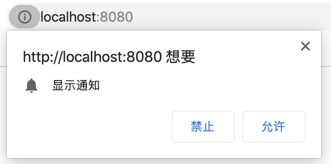
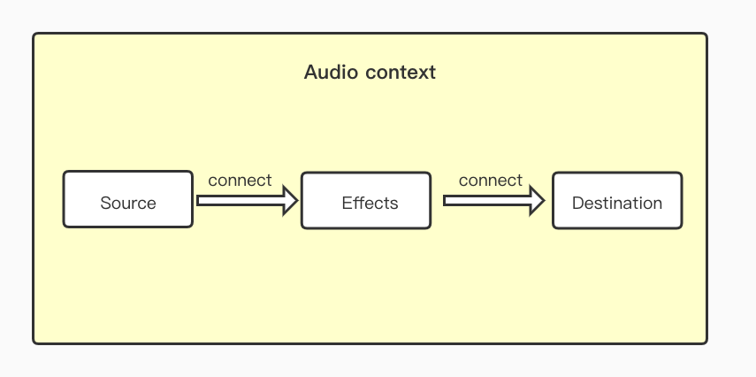

# 实践 Notifications 与 AudioContext 俩个 Web API

> **业务场景**：系统产生新消息，前端全局推送给用户，并播放提示音🎵

## Notifications
### 1.1 语法
MDN 介绍如下：
> Notifications API 允许网页或应用程序在系统级别发送在页面外部显示的通知;这样即使应用程序空闲或在后台，Web应用程序也会向用户发送信息。

在日常浏览网页时，常见的新闻、视频网站使用到 Notifications API 向用户推送新的订阅内容。

想要显示一条通知，需要经过用户同意才行。

- **Notification.requestPermission()**

该方法会使浏览器出现是否允许通知的提示，显示如下:



最新的具体语法如下，基于promise的语法

```JavaScript
Notification.requestPermission().then(function(permission) { ... });
```
通知这种事情很有可能干扰到用户，用户可以选择 允许 或 禁止，上面👆回调函数中的 `state` 就代表了用户是否允许，它有以下三种值

    - granted: 表示用户允许通知，
    - denied: 表示用户禁止
    - default: 表示用户还没做出选择

- **Notification.permission[只读]**

静态属性，表示当前是否允许，属性值和 `state` 一样，这样方便我们在其它地方获取到用户的选择

- **new Notification(title, options)**

通过 new 实例化，显示一个通知，`title` 字段必填，`options` 是个对象，常用配置下如下: 

属性名  | 解释
------------- | -------------
`body`  | 通知的主体内容
`icon`  | 通知显示的图标
`tag `  | 标记当前通知，同一`tag`仅显示一个通知，而不是叠罗汉那样
`icon`  | 通知不自动关闭

-  **Notification.close()**

手动关闭通知，如果上面 `options`中没设置一直显示的话，通知弹窗会自动关闭

-  **事件**

出现弹窗就是为了吸引用户点击，然后跳转到对于的网站去，可以在实例上绑定以下事件

**Notification.onclick**： 点击通知之后。。。。

**Notification.onerror**：异常

**Notification. onclose**：关闭

**Notification. onshow**：显示时

### 1.2 Demo

### 1.3 ⚠️注意事项
- 最新的`Chrome`浏览器，`Notifications API` 需要`https`协议才能弹出通知
- 用户一旦禁止显示通知，后续还需要用户设置

## AudioContext

### 2.1 音、视频
网页端播放音频、视频，首先想到的是 `<video>` 和 `<audio>` 标签，需要注意的是，Chrome浏览器的[自动播放政策](https://developers.google.com/web/updates/2017/09/autoplay-policy-changes)在2018年4月进行了更改，为了追求更好的用户体验，策略如下：

- 始终允许静音自动播放
- 在以下情况下，允许自动播放声音：
	- 用户已与域进行了交互（单击，点击等）。
	- 在台式机上，已经超过了用户的“ 媒体参与度索引”阈值，这意味着该用户以前曾播放有声视频。
	- 用户已将该网站添加到移动设备上的主屏幕，或在桌面上 安装了`PWA`。

判断当前媒体是否允许自动播放，可参考下面代码：

```javascript
var promise = document.querySelector('video').play();

if (promise !== undefined) {
  promise.then(_ => {
    // 允许自动播放
  }).catch(error => {
    // 禁止自动播放
    // 显示播放按钮，让用户手动操作
  });
}
```
目前很多视频网站都是默认静音播放视频，提供一个按钮，让用户取消静音

```javascript
<video id="video" muted autoplay>
<button id="unmuteButton"></button>

<script>
  unmuteButton.addEventListener('click', function() {
    video.muted = false;
  });
</script>
```
对于音频来说，不通过按钮点击，来实现自动播放，可参考下面的方案（*本次项目中使用的*）

- 通过 `iframe` 加载一个空白的 `.mp3` 文件，仅会在第一次加载时触发自动播放并隐藏显示

	```javascript
	<iframe src="audio/empty.mp3" allow="autoplay" style="display:none" id="iframeAudio"></iframe>
    ```
 
- 通过 `<video>` 加载要播放的音频，就可以轻松播放真正的音频文件
  
  ```javascript
  <audio id="player" autoplay>
       <source src="audio/source.mp3" type="audio/mp3">
  </audio>
  ```

该方案可行之处在于，Chrome 会注意到已经播放了声音，并允许在音频标签中自动播放，类似于上面提到的策略
  

### 2.2 AudioContext
对于音频文件、`<audio>` 也仅仅可以实现播放、暂停等交换，如果想调整音频音量、加入效果器、混音、可视化展示音频播放效果等，还是需要使用到 `AudioContext ` 音频上下文中进行音频操作

一个简单的效果，[Demo 演示](https://codesandbox.io/embed/heuristic-chandrasekhar-njpfp?fontsize=14&hidenavigation=1&theme=dark)

```javascript
let audioContext = new AudioContext()

let oscillator = audioContext.createOscillator()
oscillator.connect(audioContext.destination)

oscillator.start()
setTimeOut(() => {
	oscillator.stop()
}, 2000)
```
上面的代码没有引入音频文件而播放了音频，下面学习基本概念和几个常用 API



从图片中看出，想要播放出声音🔊，首先得有一个**音频环境（Audio context）**, 然后是一个**音频输入源（Inputs）**, 再加上**处理程序（Effects ）**, 然后是**音频的输出（Destination）**，也可以叫做目的地，最后是将它们所连接起来

- **音频环境**需要创建一个AudioContext实例，可以叫做**音频上下文**，一切操作都在这个环境里进行

	```
	let audioContext = new AudioContext()
	```
- **音频输入源** 可以是自定义的数据,例如 `oscillator `  振荡器，页面上的`<video>`，从用户设备输入的音频或视频，远程的音频文件等。

	创建一个振荡器，作为音频的源头
	
	```
	let oscillator = audioContext.createOscillator()
	```
	`oscillator` 表示一个振荡器，振荡器有四个属性
	- **`type`**: 震荡的波形，波形共有五种type，分别是 sine ( 正弦波)、square ( 方波)、sawtooth ( 锯齿波)、triangle ( 三角波) 和custom ( 自订)，每种波形在同样的频率下，会产生不同的声音
	-  **`frequency `**: 震荡的频率, 频率越高声音就越高
	-  **`detune`**: 音高偏移微调，将原音的音分做些微移调，造成重叠的音色效果，也就是虽然是同一个音，但经过detune偏移，就变成了不同的声音
	-  **`onended `**: 结束时会发生的事件, 监听事件，写法如: ```oscillator.onended = function(){do somting}```
	
	它产生一个周期的波形信号（如正弦波）。它是一个 `AudioScheduledSourceNode` 音频处理模块， 这个模块会生成一个指定频率的波形信号。同时，可以自定义一些属性
	
	```
	oscillator.type = 'sine';   // 振荡器输出波形为正弦波
	oscillator.frequency.value = 200;  // 振荡频率200Hz
	```
-  **处理程序（effects ）** 对音频加以控制，给音频加上各种音效。

	在知道如何利用Web Audio Api 发声之后，接着就是要来控制我们所发出来的声音，但是在我们要控制声音之前，必须要先了解「节点`AudioNode`」这个概念。在AudioContext 里，主要就是音乐节点的处理和控制，在「Effects」的阶段，在这个阶段我们就有许多的特殊节点模组( Nodes Modules )可以进行运算。
	- 「**`GainNode`**音量节点」: 控制音量使用的
	
		```javascript
      let audioContext = new AudioContext();

      let oscillator1 = audioContext.createOscillator();
      oscillator1.type = "square";
      oscillator1.frequency.value = 440;
      oscillator1.connect(audioContext.destination);
      oscillator1.start(audioContext.currentTime);
      oscillator1.stop(audioContext.currentTime + 2);

      let oscillator2 = audioContext.createOscillator();
      oscillator2.type = "square";
      oscillator2.frequency.value = 440;
      let gainNode = audioContext.createGain(); // 创建 gainNode
      gainNode.gain.value = 0.3; // 设置音量
      oscillator2.connect(gainNode); // 将声音连到 gainNode
      gainNode.connect(audioContext.destination); // 播放 gainNode
      oscillator2.start(audioContext.currentTime + 2);
      oscillator2.stop(audioContext.currentTime + 4);
		```
      上面的例子，打开之后，会先听到两秒的标准音量，再来又会听到两秒变成原本音量0.3倍的声音。[点击Demo](https://codesandbox.io/embed/vibrant-sammet-ggxiw?fontsize=14hidenavigation=1&theme=dark)
      
      同时，上面例子中用的新东西 `currentTime`, `currentTime` 是从 `audioContext`这个实例创建时就会产生的时间，并且时间会不断的变化直到我们将AudioContext移除，因此我们利用 `currentTime`就可以确保声音播放的时间，两秒后播放，四秒后停止。

	- 「**`DelayNode`**延时节点」: 控制延迟播放的

      

    - **`StereoPannerNode`**立体节点」: 只针对在2D平面上的左右移动，实际就是控制左右声道

      它也只有一个属性叫做`pan`，数值为-1到1，如果越接近-1，左边的声音就会越大声，右边就越小声，越接近1则反之，预设值为0也就是左右均等。    

- Demo
  
  利用 实现的俩个不错的项目
  - [音频可视化](http://liazm.com/audio)
  - [实现一个基本的钢琴🎹](https://codepen.io/noogn/pen/LAiDz)


## 总结
### 3.1 一句话总结
虽然正常开发中很少用到上面介绍的 API，全当熟悉认识下

### 3.2 参考链接
- [MDN Notifications API](https://developer.mozilla.org/zh-CN/docs/Web/API/notification/Using_Web_Notifications)
- [MDN AudioContext API](https://developer.mozilla.org/en-US/docs/Web/API/AudioContext)
- [MP3空白Video 仓库](https://github.com/anars/blank-audio)
- [初探Web Audio API系列篇](https://www.oxxostudio.tw/articles/201509/web-audio-api.html)
- [AudioContext + canvas实现音频可视化](https://juejin.im/post/5bffa17ef265da612e285b66)

