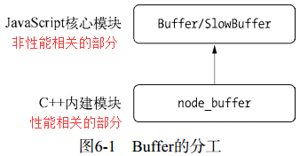

## Buffer

`Buffer` 是nodejs中用来处理二进制数据的类，其中与I/O相关的操作（网络/文件操作等）都是基于Buffer

Buffer 实例和只含有0-255的整数数组看起来很像，但是长度是固定的，内存分配在v8队内存之外。Buffer的大小是在创建时就固定的，不能更改。

Buffer 是一个全局模块，不需要使用 `require("buffer")` 

### 模块结构



`Buffer` 内存在 V8 堆栈外分配原始内存空间


**buffer实现源码**    
1. [buffer.js](https://github.com/nodejs/node/blob/503900b463/lib/buffer.js)    
2. [node_buffer.cc](https://github.com/nodejs/node/blob/503900b463/src/node_buffer.cc)

### Buffer对象

> 在 Node.js v6.x 之后 new Buffer() 接口开始被废弃, 理由是参数类型不同会返回不同类型的 Buffer 对象, 所以当开发者没有正确校验参数或没有正确初始化 Buffer 对象的内容时, 以及不了解的情况下初始化 就会在不经意间向代码中引入安全性和可靠性问题.

接口 | 用途
---- | ----
Buffer.from()	| 根据已有数据生成一个 Buffer 对象
Buffer.alloc()	| 创建一个初始化后的 Buffer 对象
Buffer.allocUnsafe()	| 创建一个未初始化的 Buffer 对象

### Buffer内存分配机制

> Buffer是一个典型的javascript与C++结合的模块，与性能有关的用C++来实现，javascript 负责衔接和提供接口。Buffer所占的内存不是V8堆内存，是独立于V8堆内存之外的内存，通过C++层面实现内存申请（可以说真正的内存是C++层面提供的）、javascript 分配内存（可以说JavaScript层面只是使用它）

> 因为处理大量的字节数据不能采用需要一点内存就向操作系统申请一点内存的方式，这可能造成大量的内存申请的系统调用，对操作系统有一定压力。

> Node在内存的使用上应用的是在C++层面申请内存，在js中分配内存的策略。  
> node采用了slab的分配机制，slab其实就是一块申请好的固定内存区域，它有3种状态：
> 1. full：完全分配状态  
> 2. partial：部分分配状态  
> 3. empty：没有被分配状态  


[**function allocate(size)**](https://github.com/nodejs/node/blob/503900b4633a541ecbebc159487f775c2669f54d/lib/buffer.js#L385) 

```js
Buffer.poolSize = 8 * 1024;

function createPool() {
  poolSize = Buffer.poolSize;
  allocPool = createUnsafeBuffer(poolSize).buffer;
  poolOffset = 0;
}

function allocate(size) {
  if (size <= 0) {
    return new FastBuffer();
  }
  if (size < (Buffer.poolSize >>> 1)) {
    if (size > (poolSize - poolOffset))
      createPool();
    const b = new FastBuffer(allocPool, poolOffset, size);
    poolOffset += size;
    alignPool();
    return b;
  }
  return createUnsafeBuffer(size);
}
```


> 从分配策略中可以看出，源码直接看来就是以8KB作为界限，如果写入的数据大于8KB一半的话直接则直接去分配内存，如果小于4KB的话则从当前分配池里面判断是否够空间放下当前存储的数据，如果不够则重新去申请8KB的内存空间，把数据存储到新申请的空间里面，如果足够写入则直接写入数据到内存空间里面。

> 看内存分配策略图，如果当前存储了2KB的数据，后面要存储5KB大小数据的时候分配池判断所需内存空间大于4KB，则会去重新申请内存空间来存储5KB数据并且分配池的当前偏移指针也是指向新申请的内存空间，这时候就之前剩余的6KB(8KB-2KB)内存空间就会被浪费

> 如果需要超过8KB的Buffer对象，将会直接分配一个SlowBuffer对象作为基础单元，这个基础单元将会被这个大Buffer对象独占

> 此外，Buffer单次的内存分配也有限制，而这个限制根据不同操作系统而不同  
> buffer.constants.MAX_LENGTH 
> 1. 对于32位的操作系统，值为(2^30)-1 (~1GB)
> 2. 对于64位操作系统，值为 (2^31)-1 (~2GB).


### Buffer与字符编码

Node.js 当前支持的字符编码有：

- `'ascii'`: 仅适用于 7 位 ASCII 数据。此编码速度很快，如果设置则会剥离高位。
- `'utf8'`: 多字节编码的 Unicode 字符。许多网页和其他文档格式都使用 UTF-8。
- `'utf16le'`: 2 或 4 个字节，小端序编码的 Unicode 字符。支持代理对（U+10000 至 U+10FFFF）。
- `'ucs2'`: 'utf16le' 的别名。
- `'base64'`: Base64 编码。当从字符串创建 Buffer 时，此编码也会正确地接受 RFC 4648 第 5 节中指定的 “URL 和文件名安全字母”。
- `'latin1'`: 一种将 Buffer 编码成单字节编码字符串的方法（由 RFC 1345 中的 IANA 定义，第 63 页，作为 Latin-1 的补充块和 C0/C1 控制码）。
- `'binary'`: 'latin1' 的别名。
- `'hex'`: 将每个字节编码成两个十六进制的字符。

```js
const buf = Buffer.from('hello world', 'ascii');

console.log(buf.toString('hex'));
// Prints: 68656c6c6f20776f726c64
console.log(buf.toString('base64'));
// Prints: aGVsbG8gd29ybGQ=

console.log(Buffer.from('fhqwhgads', 'ascii'));
// Prints: <Buffer 66 68 71 77 68 67 61 64 73>
console.log(Buffer.from('fhqwhgads', 'utf16le'));
// Prints: <Buffer 66 00 68 00 71 00 77 00 68 00 67 00 61 00 64 00 73 00>
```

### 扩展：js位运算
运算符 | 用法 | 描述
-- | -- | --
按位与（ AND）| `a & b` | 对于每一个比特位，只有两个操作数相应的比特位都是1时，结果才为1，否则为0。
按位或（OR）| `a | b` |对于每一个比特位，当两个操作数相应的比特位至少有一个1时，结果为1，否则为0。
按位异或（XOR）| `a ^ b` | 对于每一个比特位，当两个操作数相应的比特位有且只有一个1时，结果为1，否则为0。
按位非（NOT）| `~ a` |反转操作数的比特位，即0变成1，1变成0。
左移（Left shift）| `a << b` | 将 a 的二进制形式向左移 b (< 32) 比特位，右边用0填充。
有符号右移 | `a >> b` | 将 a 的二进制表示向右移 b (< 32) 位，丢弃被移出的位。
无符号右移 | `a >>> b` | 将 a 的二进制表示向右移 b (< 32) 位，丢弃被移出的位，并使用 0 在左侧填充。


### 问题

```js
var fs = require('fs');

function func1() {
  var rs = fs.createReadStream('test.txt', { highWaterMark: 11 });
  var data = '';
  rs.on('data', function (chunk) {
    data += chunk;
  });

  rs.on('end', function () {
    console.log(data);
  });
}

function func2() {
  var rs = fs.createReadStream('test.txt', { highWaterMark: 11 });
  var chunks = [];
  var size = 0;

  rs.on('data', function (chunk) {
    chunks.push(chunk);
    size += chunk.length;
  });

  rs.on('end', function () {
    var buf = Buffer.concat(chunks, size);
    console.log(buf);
    console.log(buf.toString());
  });
}

// func1()
// 窗前明��光，疑���地上霜

// func2()
// <Buffer e7 aa 97 e5 89 8d e6 98 8e e6 9c 88 e5 85 89 ef bc 8c e7 96 91 e6 98 af e5 9c b0 e4 b8 8a e9 9c 9c 0a>
// 窗前明月光，疑是地上霜
```

> `data += chunk;` 等价于 `data = data.toString() + chunk.toString();`  
> `buf.toString()`，默认编码：'utf8'

参考：
1. https://www.cnblogs.com/Ruth92/p/6132799.html
2. https://www.cnblogs.com/Ruth92/p/6132799.html
3. https://juejin.im/post/5d2db6d9f265da1bcc1975d7
4. https://nodejs.org/api/buffer.html#buffer_buffer